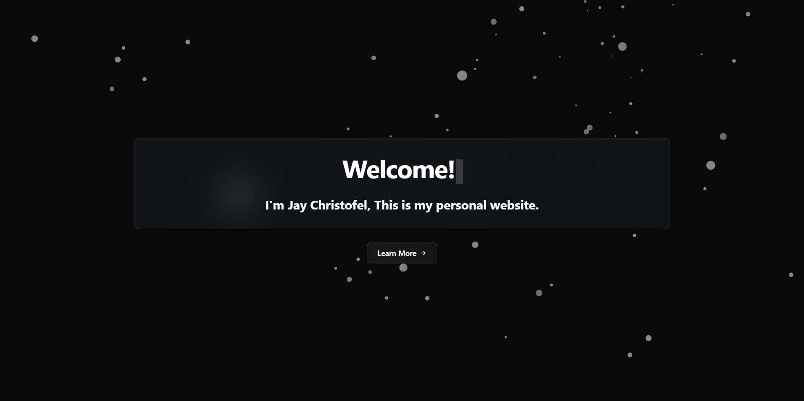

<div align="center">
   
  # 🚀 Jay Christofel Portfolio
  
  <p align="center">
    <strong>A modern, responsive portfolio website showcasing my journey as a developer</strong>
  </p>
  
  <p align="center">
    <a href="https://github.com/jaychristofel/portfolio/stargazers">
      
    </a>
    <a href="https://github.com/jaychristofel/portfolio/network/members">
      
    </a>
    <a href="https://github.com/jaychristofel/portfolio/issues">
      
    </a>
    <a href="https://github.com/jaychristofel/portfolio/blob/main/LICENSE">
      
    </a>
  </p>
  
  <p align="center">
    <a href="#-features">Features</a> •
    <a href="#-tech-stack">Tech Stack</a> •
    <a href="#-installation">Installation</a> •
    <a href="#-contributing">Contributing</a> •
    <a href="#-contact">Contact</a>
  </p>
</div>

---

<div align="center">
  
</div>

## ✨ Features

- 🎨 **Modern UI/UX** - Clean and minimalist design with glassmorphism effects
- 🌟 **Animated Background** - Interactive particle system with dynamic movement
- 📱 **Fully Responsive** - Optimized for desktop, tablet, and mobile devices
- 🎭 **Smooth Animations** - Powered by Framer Motion for seamless transitions
- 🖼️ **Project Gallery** - Interactive carousel showcasing featured projects
- 🎨 **Tech Stack Icons** - Visual representation of technologies used
- 📄 **Dynamic Resume** - Complete professional experience and skills section
- ⚡ **Lightning Fast** - Built with Vite for optimal performance
- 🌙 **Modern CSS** - Tailwind CSS v4 with custom animations
- 🎯 **SEO Optimized** - Meta tags and structured data included

## 🛠️ Tech Stack

<div align="center">

| Frontend                                                                                            | Build Tool                                                                                      | Styling                                                                                                             | Animation                                                                                                         | Language                                                                                                          |
| --------------------------------------------------------------------------------------------------- | ----------------------------------------------------------------------------------------------- | ------------------------------------------------------------------------------------------------------------------- | ----------------------------------------------------------------------------------------------------------------- | ----------------------------------------------------------------------------------------------------------------- |
|  |  |  |  |  |

</div>

### 🎨 Design System

- **UI Components:** shadcn/ui
- **Icons:** Lucide React
- **Fonts:** Inter (Google Fonts)
- **Color Palette:** Custom dark theme with glassmorphism

## 📦 Installation

### Prerequisites

- Node.js (v18 or higher)
- npm or yarn or pnpm

### Quick Start

```bash
# Clone the repository
git clone https://github.com/jaychristofel/portfolio.git

# Navigate to project directory
cd portfolio

# Install dependencies
npm install
# or
yarn install
# or
pnpm install

# Start development server
npm run dev
# or
yarn dev
# or
pnpm dev
```

### Build for Production

```bash
# Build the project
npm run build

# Preview the build
npm run preview
```

## 🚀 Deployment

This project can be easily deployed to various platforms:

### Manual Deployment

1. Run `npm run build`
2. Upload the `build` folder to your hosting provider

## 🤝 Contributing

Contributions are welcome! Please feel free to submit a Pull Request.

1. Fork the project
2. Create your feature branch (`git checkout -b feature/AmazingFeature`)
3. Commit your changes (`git commit -m 'Add some AmazingFeature'`)
4. Push to the branch (`git push origin feature/AmazingFeature`)
5. Open a Pull Request

## 📝 License

This project is licensed under the MIT License - see the [LICENSE](LICENSE) file for details.

## 🙏 Acknowledgments

- [shadcn/ui](https://ui.shadcn.com/) - For the beautiful UI components
- [Lucide](https://lucide.dev/) - For the amazing icons
- [Framer Motion](https://www.framer.com/motion/) - For smooth animations
- [Tailwind CSS](https://tailwindcss.com/) - For the utility-first CSS framework
- [React-Bits](https://tailwindcss.com/) - For the animate components

---

<div align="center">
  <p>Made with ❤️ by <a href="https://github.com/jaychristofel">Jay Christofel</a></p>
  <p>⭐ Star this repo if you find it helpful!</p>
</div>
